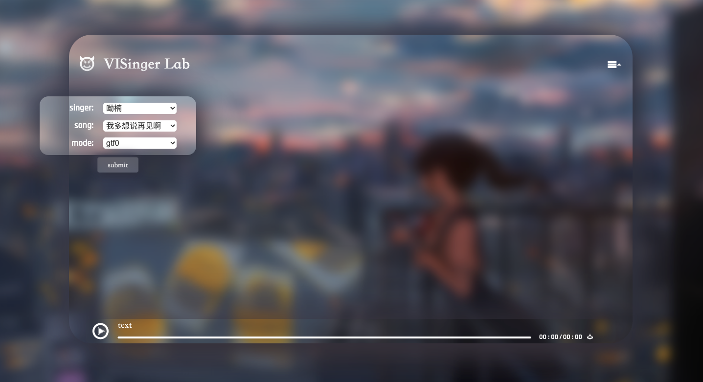
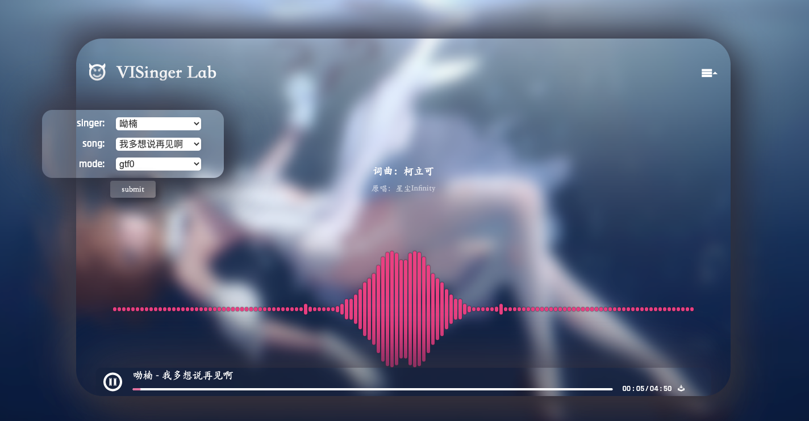
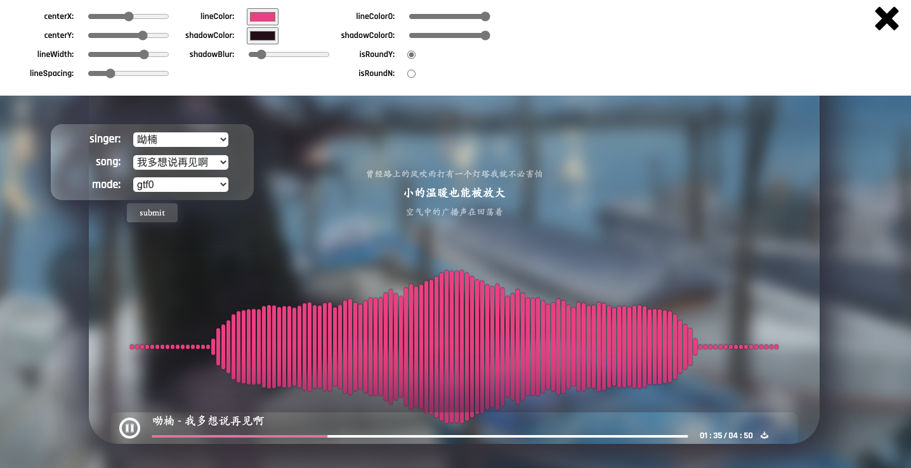

# VISinger Lab
为了展示VISinger能力设计的在线音乐播放器

## 主要技术点
前端
- [Web Audio API](https://developer.mozilla.org/en-US/docs/Web/API/BaseAudioContext) 
- eventBus

前端 [music-radio](https://github.com/miiiku/music-radio) 轮子造的不错，本身已有音频播放、可视化功能，我主要在此基础上实现了进度条控制（音频、歌词随进度条点击事件改变等）、音频下载功能。

后端
- Flask

拿flask写了个超级简易的后端，功能仅有传音频和歌词（一开始想实现实时生成的功能，但想了想只是演示没必要，于是偷懒了：）
## 运行

- `pip install flask`
- `python main.py`
- 加载自己的音频和歌词需要修改1. `main.py`中`get_wavs()`和`get_lyric()`方法；2. `static/js/AudioVisual.js`中`af.fetch`相关部分

## 预览

## 参考
https://github.com/miiiku/music-radio
